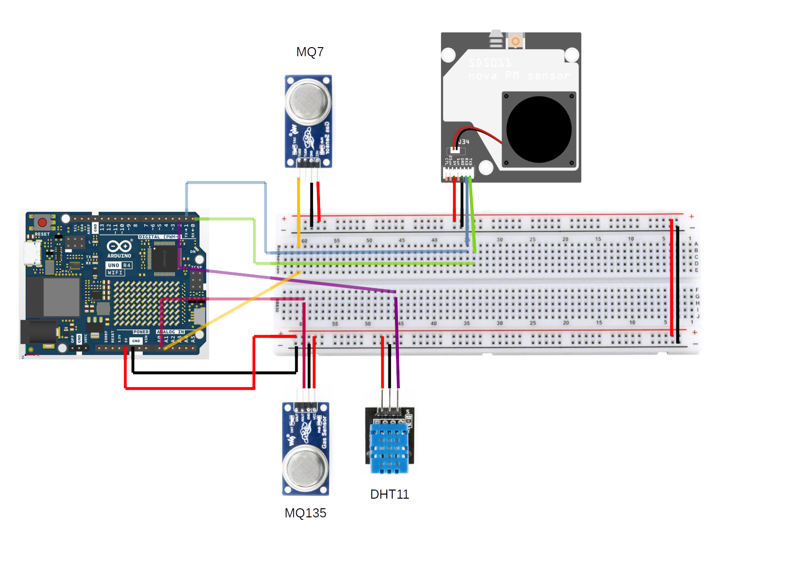
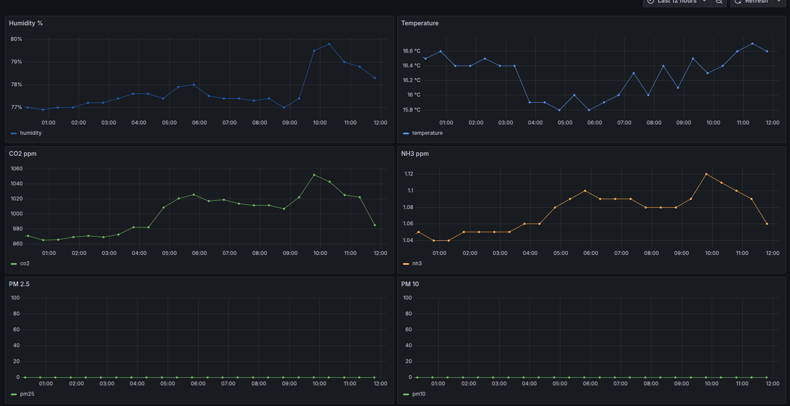
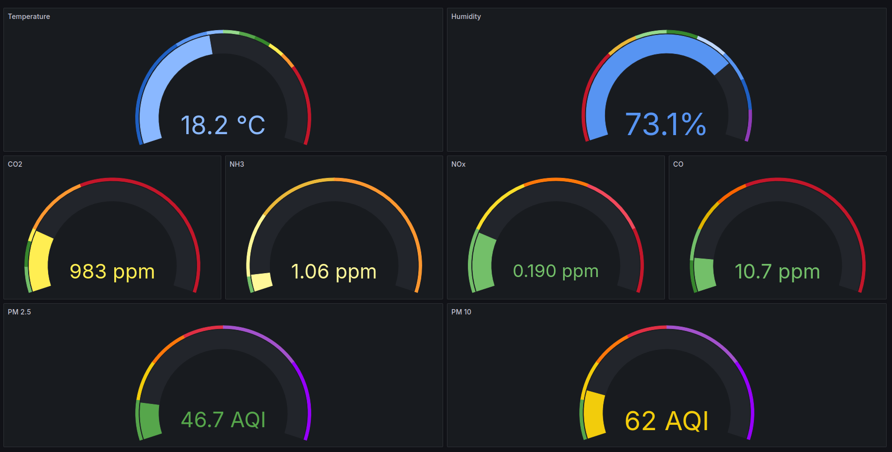

# Air Quality Monitor
# with Arduino WIFI R.2 sensor and Go Server
# integrated with Whatsapp (alarm & chatbot) and Grafana
A simple air quality monitor with Arduino UNO WIFI R2 and a Go server

## Hardware
- Arduino UNO WIFI R2
- DHT11 sensor (PIN 2) - optional (without T=20 H=50)
- MQ135 sensor (PIN A0)
- MQ7 sensor (PIN A1) 
- SDS011 PM sensor (RX -> TX-PIN 1 , TX -> RX-PIN 0) - optional
- Raspberry PI4 or PI5 - optional (only for fully automated hub with grafana)



## Sensor Features
Web server providing json data for:
- Temperature C
- Humidity %
- CO2 ppm
- NH3 ppm
- NOx ppm
- CO ppm
- PM 2.5
- PM 10

example of json response:
```
{
	"temperature": 20.00,
	"humidity": 50.00,
	"co2": 551.50,
	"nh3": 0.65,
	"nox": 0.13,
        "PM2.5": 13,
        "PM10:": 130,
	"CO": 10
}
```
On the Serial Console (9600bd) you can find device IP.
Arduino Wifi will reconnect automatically in case of connection lost.

## Server
### Build a fully automated system for Raspberry PI 4 or 5
#### Features:
- data logger
- grafana web server with graph on port 3000
- alarm whatsapp sender for CO, TEMPERATURE and PM2.5 levels
- chatbot

#### Build
The script will create RPI-AQI-Hub.tar.gz files on ../ folder, then you have to copy it on the raspberry, unzip it and run rpi_hub_install.sh
```
git clone https://github.com/iz4tow/air_quality_monitor/
./build-pi.sh
scp ../RPI-AQI-Hub.tar.gz
ssh pi@<pi IP>
tar zxvf RPI-AQI-Hub.tar.gz
sudo rpi_hub_install.sh
sudo reboot

#OPTIONAL TO CONFIGURE WHATSAPP IF SKIPPED DURING INSTALLATION
sudo su
cd /opt/airmon
whatsapp/whatsapp_login
#THEN SCAN QR CODE FROM YOUR PHONE ON WHATSAPP LINK-DEVICE 

#ALARM SERVICE
sudo tee /etc/systemd/system/airmon_alarm.service <<EOF
[Unit]
Description=Franco Air Quality Monitor Alarm
After=network.target auditd.service

[Service]
WorkingDirectory=/opt/airmon/
ExecStart=/opt/airmon/whatsapp_logger -number <YOUR NUMBER WITH COUNTRYCODE WITHOUT +, es: 393334455666>
Restart=on-failure

[Install]
WantedBy=multi-user.target
EOF
sudo systemctl enable --now airmon_alarm

#CHATBOT SERVICE
sudo tee /etc/systemd/system/airmon_chatbot.service <<EOF
[Unit]
Description=Franco Air Quality Monitor Chatbot
After=airmon.service
Requires=airmon.service

[Service]
TimeoutStartSec=100
RestartSec=60
WorkingDirectory=/opt/airmon/
ExecStart=/opt/airmon/whatsapp/whatsapp_room -number <YOUR NUMBER WITH COUNTRYCODE WITHOUT +, es: 393334455666>
Restart=on-failure

[Install]
WantedBy=multi-user.target
EOF
sudo systemctl enable --now chatbot
```

### Whatsapp chatbot
You can make your chatbot public editing systemd file adding "-password <yourpass>" to ExecStart line:
```
sudo vi /etc/systemd/system/airmon_chatbot.service
[Unit]
Description=Franco Air Quality Monitor Chatbot
After=airmon.service
Requires=airmon.service

[Service]
TimeoutStartSec=100
RestartSec=60
WorkingDirectory=/opt/airmon/
ExecStart=/opt/airmon/whatsapp/whatsapp_room -number <YOUR NUMBER WITH COUNTRYCODE WITHOUT +, es: 393334455666> -password SuperSecretPassword
Restart=on-failure

[Install]
WantedBy=multi-user.target
```
#### Whatsapp chatbot commands
From you own phone:
- status		-> send all sensor data
- host			-> send all sensor data of specific Arduino UNO Wifi sensor
- help			-> show help

From all:
If you set "-password <yourpass>" in airmon_chatbot sending <yourpass> the chatbot will send you all sensor data

#### Grafana Graph
##### Historical data


##### Near real time gauges


### Data Logger
Save data to a sqlite3 file
It is capable to look for Arduino UNO WIFI R2 with this airmon.ino sketch running on your local network.

#### Compile
```
go build --trimpath data_logger.go
```

#### How to use
```
Usage of ./data_logger:
  -debug
    	Enable debug logging
  -host string
    	API server host. If not provided data_logger will look in your network for a compatible device.
  -interval int
    	Interval between measurements in minutes. (default 30)
```
Normal run with UDP lookup
```
./data_logger
```
Normal run with known host
```
./data_logger -host 192.168.1.100
```

Debug (verbose logging)
```
./data_logger -host 192.168.1.100 -debug
```

### Data Plotter
Plot graph from sqlite3 data

#### Compile
```
go build --trimpath data_plotter.go
```

#### How to use
```
Usage of ./data_plotter:
  -end string
    	End time (YYYY-MM-DD HH:MM:SS)
  -field string
    	Field to plot (all, Temperature, Humidity, CO2, NH3, NOx) (default "all")
  -onefile
    	Generate a single PNG with all graphs
  -output string
    	Output image file (default "output.png")
  -start string
    	Start time (YYYY-MM-DD HH:MM:SS)
```

Multiple image output
```
./data_plotter
```

Single image with all graph
```
./data_plotter -onefile
```
